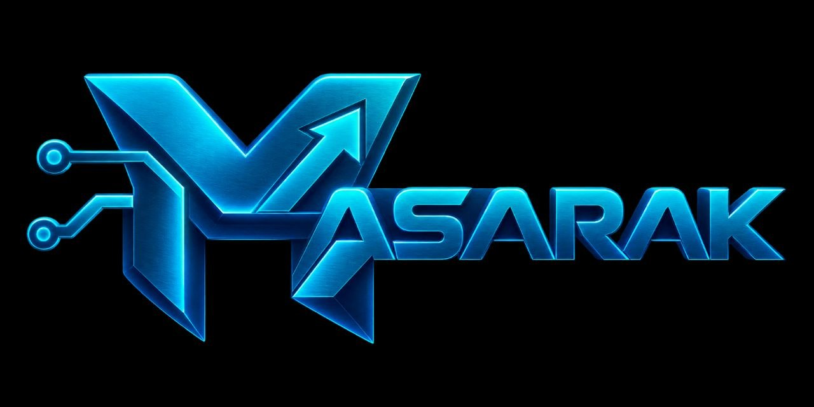

<div dir="rtl" lang="ar">

<div align="center">

<div align="center" style="background-color:#ffffff; padding:20px; border-radius:12px;">
  
</div>

# مسارك | Masarak

### منصة للتوجيه الأكاديمي والمهني لطلاب الثانوية في اليمن

</div>

---

## وصف المشروع

**مسارك** منصة ويب تساعد طلاب المرحلة الثانوية في اليمن على استكشاف ميولهم وفهم الخيارات الأكاديمية والمهنية المتاحة أمامهم بصورة أكثر تنظيمًا ووعيًا.

تجمع المنصة بين دليل واضح للتخصصات وتجربة استكشافية للميول تعتمد على نموذج **RIASEC**، ثم تعرض للطالب نتيجة تفسيرية وتوصيات تساعده على معرفة التخصصات التي تستحق منه مزيدًا من البحث والاستكشاف.

> المنصة أداة توجيه واستكشاف، وليست اختبارًا نفسيًا تشخيصيًا أو بديلًا عن قرار الطالب وأسرته والمرشدين.

---

## المشكلة

يواجه كثير من طلاب الثانوية صعوبة في اختيار التخصص الجامعي بسبب:

- محدودية المعرفة بالتخصصات ومساراتها.
- عدم وضوح الميول الشخصية والمهنية.
- الاعتماد على الانطباعات أو آراء الآخرين فقط.
- صعوبة مقارنة الخيارات المتاحة بصورة منظمة.
- نقص المحتوى الموجه للسياق الذي يعيش فيه الطالب.

يهدف **مسارك** إلى تقليل هذا التشتت من خلال تقديم معلومات منظمة وتجربة استكشافية تساعد الطالب على فهم نفسه وخياراته قبل اتخاذ القرار.

---

## المستخدمون المستهدفون

### الطالب

طالب المرحلة الثانوية الذي يريد:

- استكشاف التخصصات.
- معرفة ميوله المهنية بصورة أولية.
- الحصول على توصيات وتفسير واضح للنتيجة.
- الرجوع إلى نتائجه واستكمال رحلة الاستكشاف.

### الزائر

مستخدم لم يسجل الدخول بعد ويريد:

- التعرف على المنصة.
- تصفح التخصصات.
- قراءة معلومات التخصصات ومقارنتها قبل إنشاء حساب.

---

# نطاق الـMVP المستهدف

يشمل نطاق النسخة الأولى:

- دليل تخصصات أكاديمية ثابت داخل المشروع.
- تصفح معلومات التخصصات ومقارنتها.
- إنشاء حساب وتسجيل الدخول والخروج.
- حفظ تقدم الطالب.
- تقييم استكشافي مكوّن من **18 موقفًا × 4 خيارات**.
- حفظ الإجابات أثناء التقييم.
- حساب مؤشرات **RIASEC** على الخادم.
- تفسير النتيجة بلغة توجيهية غير تشخيصية.
- تقديم توصيات متعددة مرتبطة بالتخصصات.
- الاحتفاظ بنتائج الطالب السابقة.
- واجهة عربية RTL ومتجاوبة.
- اختبارات آلية وفحوص Build قبل الدمج.

### خارج نطاق الـMVP الحالي

- لوحة إدارة.
- الإحصائيات الإدارية.
- CRUD لإدارة التخصصات من داخل النظام.
- API عامة مستقلة.
- تطبيق Mobile مستقل.
- التشخيص النفسي أو القياس السيكومتري المعتمد.
- اتخاذ قرار أكاديمي أو مهني إلزامي نيابة عن الطالب.

> وجود الوظيفة ضمن نطاق الـMVP يعني أنها جزء من النسخة المستهدفة، وليس بالضرورة أنها منفذة حاليًا. حالة التنفيذ الفعلية تتابع من خلال GitHub Issues وPull Requests والفرع `main`.

---

# أعضاء الفريق

| الاسم | الرقم الجامعي | الدور في المشروع | GitHub Username |
|---|---|---|---|
| الحارث الداهية | — | Technical Lead / Integration / Repository Coordination | — |
| مالك | — | Backend & Business Logic | — |
| أيمن | — | Frontend & UX | — |
| عبدالله حمود | — | Testing, Data & QA | — |
| ملاطف | — | Content, Specializations & UAT | — |

> تُستكمل الأرقام الجامعية وأسماء GitHub قبل التسليم النهائي.

## المراجعة التقنية الخارجية

| الاسم | الدور | GitHub Username |
|---|---|---|
|م. طارق العمري | External Technical Reviewer | [@tareq-alomari](https://github.com/tareq-alomari) |

> يقوم المراجع التقني الخارجي بمراجعة الأعمال المنجزة والقرارات التقنية وPull Requests الرئيسية  وتقديم ملاحظات فنية على جودة التنفيذ واتساقه， 
---

# التقنيات المتوقعة والمعتمدة

| المجال | التقنية |
|---|---|
| Backend | Laravel 12 |
| Runtime | PHP 8.2+ |
| Database | MySQL 8.4.x |
| ORM | Eloquent |
| Frontend | Blade |
| Styling | Tailwind CSS |
| Client Logic | JavaScript / Fetch |
| Authentication | Laravel Session + Cookies + CSRF |
| Build Tool | Vite |
| Node.js | 24.x |
| PHP Packages | Composer 2.x |
| JavaScript Packages | npm |
| Testing | PHPUnit / Laravel Tests |
| Version Control | Git |
| Collaboration | GitHub |

### القرارات التقنية الأساسية

```text
Laravel Monolith
Blade + Tailwind CSS
JavaScript / Fetch
MySQL 8.4.x
Laravel Session Authentication
routes/web.php
Static specialization catalog
Server-side RIASEC processing
```

لا يعتمد المشروع في الـMVP على:

```text
React
Vue
SPA
Laravel Breeze
Laravel Sanctum
JWT
API Tokens
SQLite
MariaDB
```

---

# بيانات التخصصات

يتم الاحتفاظ ببيانات التخصصات في ملف ثابت داخل المشروع:

```text
resources/data/specializations.json
```

ولا توجد في الـMVP الحالي:

```text
Specializations Database Table
Admin CRUD
Content Management Dashboard
```

---

# وثائق المشروع

يتضمن المستودع الوثائق المطلوبة لإدارة المشروع وتتبع العمل، ومنها:

| الوثيقة | الغرض |
|---|---|
| Mini-SRS / Requirements | توثيق متطلبات النظام ونطاقه |
| Project Brief | تعريف المشروع والمشكلة والهدف |
| Team Roles | توزيع المسؤوليات داخل الفريق |
| AI Usage Log | توثيق الاستخدام المؤثر للذكاء الاصطناعي |
| Deliverables Checklist | متابعة متطلبات التسليم |
| Technical Decisions | القرارات التقنية المعتمدة |
| System Architecture | معمارية النظام |
| System Workflows | مسارات العمل |
| Use Cases | حالات استخدام النظام |

أهم الملفات:

```text
AI_Log.md
DELIVERABLES_CHECKLIST.md
docs/
```

---

# طريقة العمل

يستخدم الفريق:

```text
GitHub Issues
Branches
Commits
Pull Requests
Code Review
GitHub Projects
```

وتبدأ كل مهمة من Issue واضحة، ثم تنفذ في Branch مؤقت، ويُرفع Pull Request ويراجعه عضو آخر قبل الدمج.

المسار المعتمد:

```text
Issue
→ Branch
→ Implementation
→ Commit
→ Push
→ Pull Request
→ Review
→ Squash Merge
→ Delete Branch
```

الفرع الدائم الوحيد:

```text
main
```

ولا يتم التطوير المباشر عليه.

---

# تشغيل المشروع

## 1. المتطلبات

يجب توفر:

```text
Git 2.x
PHP 8.2+
Composer 2.x
Node.js 24.x
npm
MySQL 8.4.x
```

---

## 2. تثبيت الأدوات على Windows

### Git

```bat
winget install --id Git.Git -e
```

### PHP 8.2

```bat
winget install --id PHP.PHP.8.2 -e
```

### Composer

```bat
powershell -NoProfile -Command "$p=Join-Path $env:TEMP 'Composer-Setup.exe'; Invoke-WebRequest 'https://getcomposer.org/Composer-Setup.exe' -OutFile $p; Start-Process $p -Wait"
```

### Node.js

```bat
winget install --id OpenJS.NodeJS.LTS -e
```

### MySQL

```bat
winget install --id Oracle.MySQL -e
```

بعد التثبيت افتح Terminal جديدًا.

---

## 3. سحب المشروع

```bat
git clone https://github.com/BitSoft-IT/msarak.git
cd msarak
```

---

## 4. فحص البيئة

```bat
scripts\check-environment.bat
```

النتيجة المطلوبة:

```text
Environment check: PASS
```

---

## 5. إعداد MySQL

```bat
scripts\setup-database.bat
```

عند ظهور:

```text
MySQL administrator username [root]:
```

اضغط `Enter` إذا كان المستخدم الإداري هو:

```text
root
```

ثم أدخل كلمة مرور MySQL المحلية.

الإعداد المستهدف:

```text
Database : masarak
User     : masarak_user
Server   : MySQL 8.4.x
```

بيانات الاتصال الخاصة بالمشروع تحفظ محليًا في:

```text
.env
```

ولا يتم رفع `.env` إلى GitHub.

---

## 6. إعداد المشروع

```bat
scripts\setup-project.bat
```

يتولى السكربت:

```text
Composer dependencies
npm dependencies
APP_KEY
Laravel configuration
Database migrations
Laravel tests
Frontend build
```

النتيجة المطلوبة:

```text
Masarak project setup: PASS
```

---

## 7. التحقق الكامل

```bat
scripts\verify-project.bat
```

يفحص:

```text
Environment
PHP requirements
Dependencies
MySQL connection
Migrations
Laravel tests
Frontend build
```

النتيجة المطلوبة:

```text
FULL VERIFICATION: PASS
```

---

## 8. تشغيل المشروع

```bat
scripts\start-project.bat
```

التطبيق:

```text
http://127.0.0.1:8000
```

Health Check:

```text
http://127.0.0.1:8000/up
```

---

# التشغيل اليدوي

بعد إعداد `.env` وقاعدة البيانات:

```bat
composer install
npm ci
php artisan config:clear
php artisan migrate
php artisan test
npm run build
```

ثم:

### Terminal 1

```bat
php artisan serve
```

### Terminal 2

```bat
npm run dev
```

---

# Clean Clone Verification

تم إجراء اختبار **Clean Clone** فعلي من GitHub على بيئة نظيفة للمشروع.

النتيجة:

```text
Repository Structure      PASS
Environment Check         PASS
Database Setup            PASS
Composer Install          PASS
npm Install               PASS
Laravel Preparation       PASS
Database Migrations       PASS
Laravel Tests             PASS
Vite Build                PASS
MySQL Connection          PASS
Full Verification         PASS
Git Safety Check          PASS
```

بيئة الاختبار:

```text
Laravel    12.69.1
PHP        8.2.12
Composer   2.9.5
Node.js    24.13.1
npm        11.8.0
MySQL      8.4.11
Git        2.50.1
```

وتم التحقق فعليًا من اتصال Laravel بـ:

```text
MySQL 8.4.11
```

---

# هيكل المشروع
</div>

```text
masarak/
├── app/
├── bootstrap/
├── config/
├── database/
├── docs/
│   ├── 00-baseline/
│   ├── 01-management/
│   ├── 02-system-design/
│   ├── 03-system-analysis/
│   ├── 04-assessment/
│   └── assets/
├── public/
├── resources/
│   ├── css/
│   ├── data/
│   ├── js/
│   └── views/
├── routes/
├── scripts/
│   ├── check-environment.bat
│   ├── setup-database.bat
│   ├── setup-project.bat
│   ├── start-project.bat
│   └── verify-project.bat
├── tests/
├── AI_Log.md
├── DELIVERABLES_CHECKLIST.md
├── composer.json
├── composer.lock
├── package.json
└── package-lock.json
```

<div dir="rtl" lang="ar">
---

# Git Workflow

## بدء مهمة

ابدأ من أحدث نسخة من `main`:

```bat
git switch main
git pull --ff-only origin main
git switch -c feature/<issue>-<name>
```

أمثلة:

```text
feature/12-assessment-flow
fix/18-save-answer
test/21-scoring-tests
docs/7-course-documentation
chore/project-setup-scripts
```

---

## قبل الـCommit

```bat
git status
git diff --check
git add .
git diff --cached --check
```

ثم:

```bat
git commit -m "type: short description"
```

الأنواع المستخدمة:

```text
feat
fix
test
docs
refactor
chore
style
```

---

## رفع الفرع

```bat
git push -u origin اسم-الفرع
```

ثم يتم إنشاء Pull Request.

---

## مراجعة ودمج العمل

يشترط:

- ربط التغيير بالـIssue.
- مراجعة من عضو غير منفذ المهمة.
- معالجة الملاحظات المانعة.
- التأكد من نجاح الفحوص.
- Squash Merge.
- حذف الفرع المؤقت بعد الدمج.

---

# قواعد المشروع

- لا يتم Push مباشر إلى `main`.
- لا يتم رفع `.env`.
- لا يتم رفع Passwords أو Tokens أو Secrets.
- يتم تتبع `composer.lock`.
- يتم تتبع `package-lock.json`.
- لا يتم استخدام `composer update` أثناء الإعداد الطبيعي.
- لا يتم استخدام `npm update` أثناء الإعداد الطبيعي.
- لا تضاف ميزة خارج نطاق المشروع دون Issue وقرار واضح.
- لا يغير عضو قرارًا معتمدًا بصورة فردية.
- يجب فهم أي كود مولد بالذكاء الاصطناعي قبل استخدامه.
- الاستخدام المؤثر للذكاء الاصطناعي يوثق في `AI_Log.md`.
- يتم التحقق من العمل قبل اعتبار الـIssue مكتملة.

---

# فحوص ما قبل الدمج

بحسب طبيعة التغيير:

```bat
php artisan test
npm run build
scripts\verify-project.bat
```

ويجب ألا يحتوي Git على:

```text
.env
Passwords
Tokens
Credentials
Secrets
```

---
# حالة المشروع

## التقدم الحالي

### 
</div>

مكتمل

- [x] اعتماد فكرة المشروع ونطاقه الأساسي.
- [x]     إعداد وتوحيد وثائق المشروع الأساسية.
- [x]     إنشاء المستودع الرسمي وضبط حماية فرع `main`.
- [x] إعداد قوالب `Issues` و`Pull Requests`.
- [x] إنشاء الـLabels المعتمدة لتنظيم العمل.
- [x] إنشاء `GitHub Project` واعتماد حالات سير العمل:
  `Backlog → Ready → In Progress → In Review → Done`
- [x] إنشاء خمسة `Milestones` رئيسية:
  `Foundation`، `Core Setup`، `Assessment Journey`، `Results & Security`، `Finalization & Release`
- [x] إنشاء وتنظيم **15 Issue** وتوزيعها على الـMilestones.
- [x] إعداد `GitHub Actions` للتحقق الآلي ضمن مسار الدمج.
- [x] تجهيز سكربتات البيئة والإعداد والتحقق.
- [x] اجتياز اختبار `Clean Clone` بنجاح.

---

### قيد التنفيذ

- [x] إكمال `Batch 1 — Foundation`.
- [x] تنفيذ `Batch 2 — Core Setup`.
- [ ] تنفيذ `Batch 3 — Assessment Journey`.
- [ ] تنفيذ `Batch 4 — Results & Security`.
- [ ] تنفيذ `Batch 5 — Finalization & Release`.
- [ ] إغلاق جميع الـIssues المتبقية ودمج الـPull Requests المعتمدة.
- [ ] إجراء التحقق النهائي وتجهيز النسخة النهائية للتسليم.

<div dir="rtl" lang="ar">

> يتم تتبع الحالة التفصيلية لكل مهمة من خلال GitHub Issues وMilestones وPull Requests.
> نجاح إعداد المشروع لا يعني اكتمال وظائف الـMVP؛ اكتمال كل وظيفة يحدد من خلال الـIssue ومعايير القبول والـPull Request المرتبطة بها.

---

# أمان المشروع

لا يحتوي المستودع على بيانات الاعتماد المحلية.

الملف:

```text
.env
```

محلي فقط وممنوع رفعه إلى GitHub.

يستخدم Laravel في المشروع:

```text
Sessions
Cookies
CSRF Protection
Password Hashing
```

ولا تستخدم بيانات حساب MySQL الإداري `root` لتشغيل التطبيق اليومي.

---

# المرجع التشغيلي السريع

لعضو قام بسحب المشروع لأول مرة:

```bat
git clone https://github.com/BitSoft-IT/msarak.git
cd msarak

scripts\check-environment.bat
scripts\setup-database.bat
scripts\setup-project.bat
scripts\verify-project.bat
scripts\start-project.bat
```

إذا ظهرت:

```text
Environment check: PASS
Masarak project setup: PASS
FULL VERIFICATION: PASS
```

فالبيئة المحلية جاهزة لبدء العمل.

---

<div align="center">

### Masarak

**Academic & Career Guidance for Yemeni High School Students**

</div>

</div>
