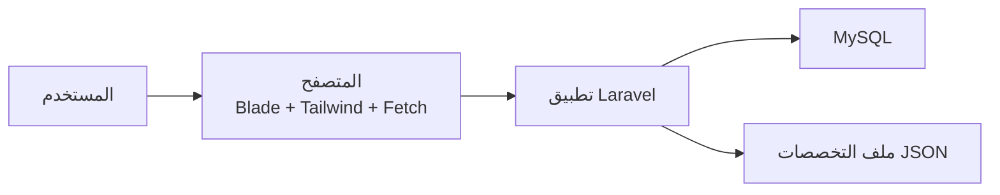
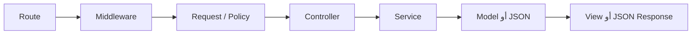
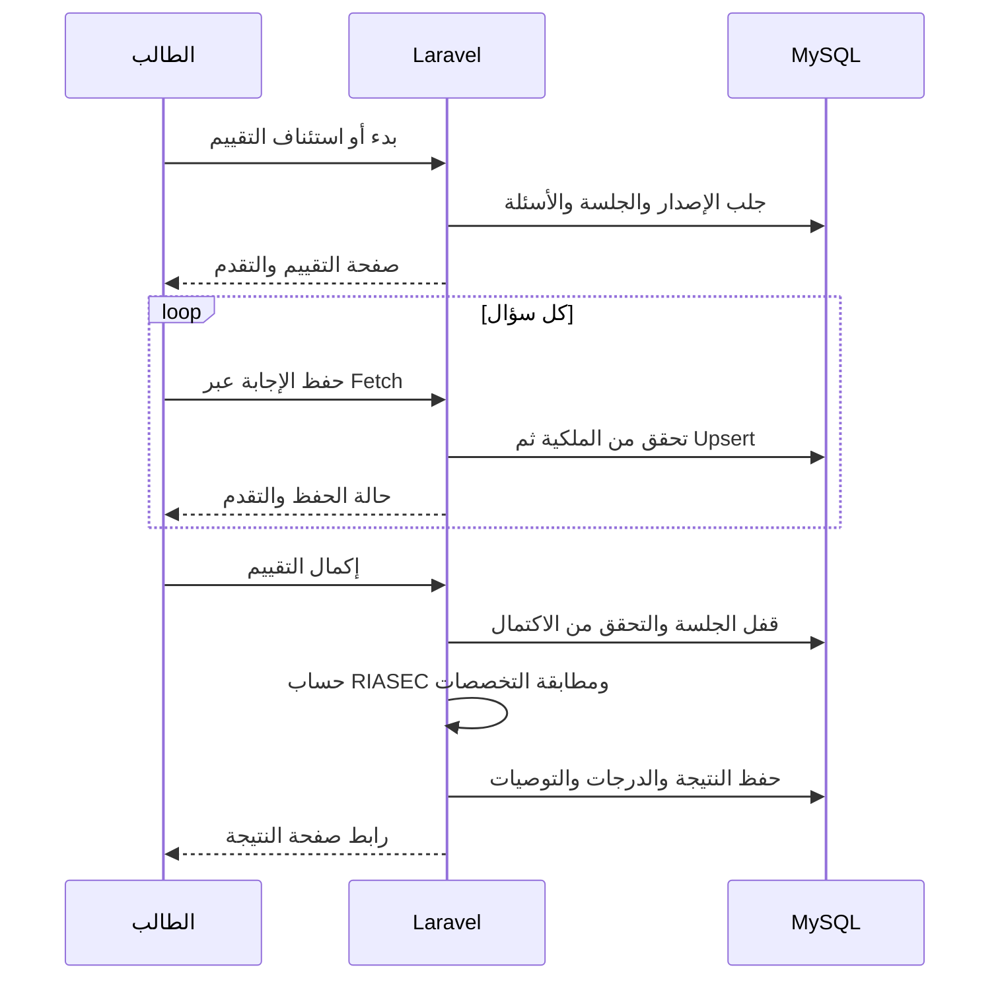

<div dir="rtl" lang="ar">

# معمارية النظام

**المشروع:** مسارك — منصة التوجيه الأكاديمي والمهني لطلاب الثانوية  
**الحالة:** معتمدة للتنفيذ  
**آخر تحديث:** 2026-09-11

## 1. الهدف

تحدد هذه الوثيقة الشكل العام للنظام، وحدود أجزائه، ومكان البيانات والمنطق. أما تفاصيل الجداول فتوجد في `08-data-model-and-diagrams.md`، والمسارات في `09-system-contracts.md`، والفئات والخدمات في `10-detailed-design.md`.

القرار الأساسي: **النظام تطبيق Laravel واحد منظم داخليًا، وليس مجموعة تطبيقات أو خدمات منفصلة.**

---

## 2. الشكل العام

يتكون النظام من أربعة أجزاء مترابطة:

| الجزء | وظيفته |
|---|---|
| المتصفح | عرض صفحات Blade وتشغيل JavaScript الخاص بالتفاعل. |
| تطبيق Laravel | المصادقة، الصلاحيات، قواعد العمل، الحساب، المطابقة، وإرجاع الصفحات أو JSON. |
| MySQL | حفظ الحسابات والأسئلة والجلسات والإجابات والنتائج. |
| ملف التخصصات | JSON ثابت داخل الخادم يحتوي على دليل التخصصات وملفات RIASEC. |



المتصفح لا يتصل بقاعدة البيانات أو ملف JSON مباشرة؛ جميع البيانات تمر عبر Laravel.

---

## 3. لماذا تطبيق واحد؟

هذا الاختيار مناسب لأن النسخة الأولى:

- موقع ويب بواجهات Blade.
- يديرها فريق صغير من خمسة أعضاء.
- لا تحتوي تطبيق هاتف أو تكاملًا خارجيًا.
- تحتاج مصادقة Sessions وCSRF بدل API Tokens.
- تحتاج نشرًا وتشغيلًا بسيطين.

لذلك لا نضيف SPA أو Microservices أو API عامة. يمكن إعادة تقييم ذلك مستقبلًا إذا ظهر احتياج فعلي جديد.

---

## 4. الطبقات الداخلية

يمر الطلب بالطبقات اللازمة له فقط:



| الطبقة | مسؤوليتها | لا يجب أن تفعل |
|---|---|---|
| Route | تعريف عنوان الطلب وربطه بالـController. | تنفيذ منطق أعمال. |
| Middleware | التحقق من الدخول والدور. | حساب النتيجة أو قراءة المحتوى. |
| Form Request | التحقق من شكل المدخلات وقيمها الأساسية. | تنفيذ عملية كاملة أو حفظ بيانات متعددة. |
| Policy | التحقق من ملكية المورد وصلاحية المستخدم. | التحقق من تنسيق الحقول. |
| Controller | استقبال الطلب واستدعاء الجزء المناسب وإرجاع الاستجابة. | حمل الحساب أو Transaction طويلة. |
| Service | تنفيذ قواعد المشروع والعمليات المركبة. | عرض HTML أو الاعتماد على تفاصيل المتصفح. |
| Model | تمثيل الجدول والعلاقات والاستعلامات القريبة منه. | إدارة رحلة استخدام كاملة. |
| View | عرض البيانات للمستخدم. | حساب RIASEC أو اتخاذ قرار أمني. |
| JavaScript | التفاعل وإرسال Fetch وعرض حالته. | تنفيذ الحساب أو المطابقة أو فرض الصلاحيات. |

لا ننشئ طبقة أو ملفًا لمجرد اكتمال الشكل؛ يُنشأ الجزء فقط عندما توجد له مسؤولية فعلية.

---

## 5. وحدات النظام

| الوحدة | مسؤوليتها الأساسية | المستخدم |
|---|---|---|
| الصفحات العامة | الرئيسية ودليل التخصصات والتفاصيل والمقارنة. | الزائر والطالب |
| المصادقة والحساب | التسجيل والدخول والخروج والاستعادة والملف الشخصي. | الطالب والمدير |
| جلسة التقييم | البدء والاستئناف وعرض الأسئلة وحفظ الإجابات والتقدم. | الطالب |
| الحساب والتوصية | التحقق من الإكمال وحساب RIASEC ومطابقة التخصصات وحفظ النتيجة. | النظام |
| النتائج | سجل النتائج وعرض نتيجة الطالب وتفسيرها. | الطالب |
| إدارة التقييم | المسودات والأسئلة والخيارات ونشر إصدار جديد. | المدير |
| الإحصائيات | أعداد الجلسات ونسبة الإكمال وأكثر التخصصات ظهورًا. | المدير |

إدارة التخصصات ليست وحدة إدارية في النسخة الأولى؛ محتواها يحدث من ملف JSON بمراجعة GitHub.

---

## 6. توزيع البيانات

### MySQL

يحفظ البيانات المتغيرة التي تحتاج علاقات وقيودًا وتاريخًا:

- المستخدمين والأدوار.
- إصدارات التقييم.
- الأسئلة الثمانية عشر والخيارات الأربعة لكل سؤال.
- جلسات التقييم والإجابات.
- النتائج ودرجات RIASEC.
- التوصيات المحفوظة مع كل نتيجة.

### JSON داخل الخادم

المسار المعتمد:

```text
resources/data/specializations.json
```

يحتوي على:

- التخصصات العشرة.
- معلومات كل تخصص ومصادره.
- ملف RIASEC المستخدم في المطابقة.
- إصدار الكتالوج وبنية الحقول المعتمدة.

يقرأه `SpecializationCatalogService`. لا يوجد جدول `specializations` ولا CRUD إداري له.

### المتصفح

يحتفظ فقط بحالة العرض المؤقتة اللازمة للتفاعل. لا يعد مصدرًا للحقيقة ولا يحفظ منطق الحساب أو الأوزان.

---

## 7. المصادقة والأمان

- المصادقة تعتمد على Laravel Session وCookies.
- كل طلب يغير البيانات محمي بـCSRF.
- مسارات الطالب والمدير محمية بـMiddleware مناسب.
- Policies تمنع الطالب من الوصول إلى جلسة أو نتيجة لا يملكها.
- الحساب والمطابقة والأوزان تبقى على الخادم.
- كلمات المرور تمر عبر Laravel `Hash`.
- المدخلات تمر عبر Validation.
- العمليات المركبة الحساسة تستخدم Transactions.
- لا توجد Sanctum أو JWT أو API Tokens في النسخة الأولى.
- لا يعتمد المشروع Laravel Breeze كStarter Kit.

إخفاء زر في الواجهة ليس حماية؛ القرار الأمني يجب أن يطبقه الخادم دائمًا.

---

## 8. أنواع الاستجابة

يستخدم التطبيق نوعين فقط:

| النوع | الاستخدام |
|---|---|
| Blade/HTML | الصفحات الكاملة مثل الدليل والتقييم والنتيجة ولوحة المدير. |
| JSON عبر Fetch | حفظ إجابة، إكمال التقييم، وعمليات المدير الجزئية. |

جميع المسارات داخل `routes/web.php` وتستفيد من Session وCSRF. استخدام JSON هنا لا يحول النظام إلى API عامة.

---

## 9. رحلة التقييم



قواعد الرحلة:

- يبدأ الطالب جلسة جديدة أو يستأنف جلسته غير المكتملة وفق القاعدة المعتمدة.
- لا ترسل رموز RIASEC أو الأوزان إلى المتصفح.
- حفظ الإجابة قابل للتكرار دون إنشاء نسخة مكررة.
- إكمال الجلسة عملية ذرية وغير مكررة.
- النتيجة القديمة لا تتغير عند تحديث الأسئلة أو ملف التخصصات لاحقًا.

---

## 10. الحساب والمطابقة

عند الإكمال:

1. يتحقق `AssessmentCompletionService` من الجلسة والملكية وشروط الإكمال.
2. يحسب `ScoringService` درجات مجالات RIASEC الستة.
3. يقرأ `SpecializationCatalogService` إصدار ملف التخصصات المعتمد.
4. يقارن `RecommendationService` الدرجات بملفات التخصصات.
5. يحفظ النظام النتيجة والدرجات و3–5 توصيات ونسخة أسمائها.
6. تعرض Blade النتيجة بوصفها مؤشرًا توجيهيًا لا حكمًا نهائيًا.

سبب تنفيذ المطابقة على الخادم:

- حماية منطق الحساب والأوزان.
- توحيد النتيجة لجميع المستخدمين.
- اختبار الحساب والمطابقة بصورة مستقلة.
- حفظ التوصيات التي ظهرت وقت إنشاء النتيجة.

---

## 11. إدارة الأسئلة والإصدارات

- الأسئلة محفوظة داخل إصدارات تقييم.
- يعمل المدير على مسودة فقط.
- السؤال وخياراته الأربعة وحدة تعديل واحدة.
- لا يعدل إصدار منشور أو متقاعد.
- لا ينشر الإصدار إلا بعد تحقق العدد والبنية والتوازن المعتمد.
- ترتبط كل جلسة بإصدار محدد حتى لا تتغير أثناء تقدم الطالب.
- النتائج السابقة لا يعاد حسابها تلقائيًا بعد نشر إصدار جديد.

---

## 12. العمليات التي تحتاج Transaction

| العملية | سبب الذرية |
|---|---|
| إنشاء أو استئناف جلسة | منع تكرار الجلسات غير المكتملة. |
| حفظ الإجابة | ضمان استبدال الإجابة نفسها دون ازدواج. |
| إكمال التقييم | حفظ النتيجة والدرجات والتوصيات وتغيير حالة الجلسة كوحدة واحدة. |
| نشر إصدار | تثبيت الإصدار الجديد وإحالة السابق بصورة متسقة. |

تفاصيل القفل والقيود موجودة في نموذج البيانات والتصميم الداخلي.

---

## 13. قابلية التوسع دون تعقيد مبكر

المعمارية الحالية تسمح مستقبلًا بـ:

- إضافة تخصصات بتحديث JSON وبنيته المعتمدة.
- نشر إصدار تقييم جديد دون تغيير نتائج الطلاب السابقة.
- إضافة API مستقلة إذا ظهر تطبيق هاتف فعلي.
- نقل المحتوى إلى إدارة ديناميكية فقط إذا أصبح التحديث المتكرر مطلبًا معتمدًا.
- إضافة Queue أو Cache عندما تثبت الحاجة بقياس فعلي.

هذه إمكانات مستقبلية وليست مهامًا ضمن النسخة الأولى.

---

## 14. قرارات ممنوعة في النسخة الأولى

- فصل Frontend وBackend إلى مشروعين.
- إضافة Microservices.
- استخدام Sanctum أو JWT دون API خارجية معتمدة.
- استخدام SQLite بدل MySQL.
- إرسال الحساب أو الأوزان إلى JavaScript.
- قراءة ملف التخصصات مباشرة من المتصفح.
- إنشاء جدول أو CRUD للتخصصات.
- وضع منطق الأعمال داخل Controller أو View.
- تكرار النتيجة عند إعادة طلب الإكمال.

---

## 15. حدود الوثائق

| السؤال | المرجع |
|---|---|
| ما التقنيات المعتمدة؟ | `02-technical-decisions.md` |
| ما الجداول والعلاقات والقيود؟ | `08-data-model-and-diagrams.md` |
| ما المسارات والمدخلات والاستجابات؟ | `09-system-contracts.md` |
| ما Services وControllers وPolicies؟ | `10-detailed-design.md` |
| من ينفذ كل جزء؟ | `05-team-roles.md` و`06-work-plan-25-issues.md` |
| كيف يدار العمل والدمج؟ | `03-code-management-guide.md` و`01-code-review-guide.md` |

هذه الوثيقة تستبدل المعمارية القديمة التي وضعت JSON والمطابقة في Client أو اقترحت Sanctum كخيار.

</div>
