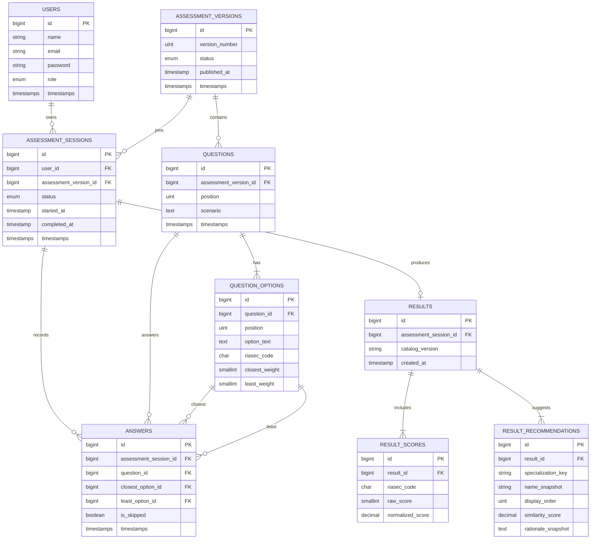
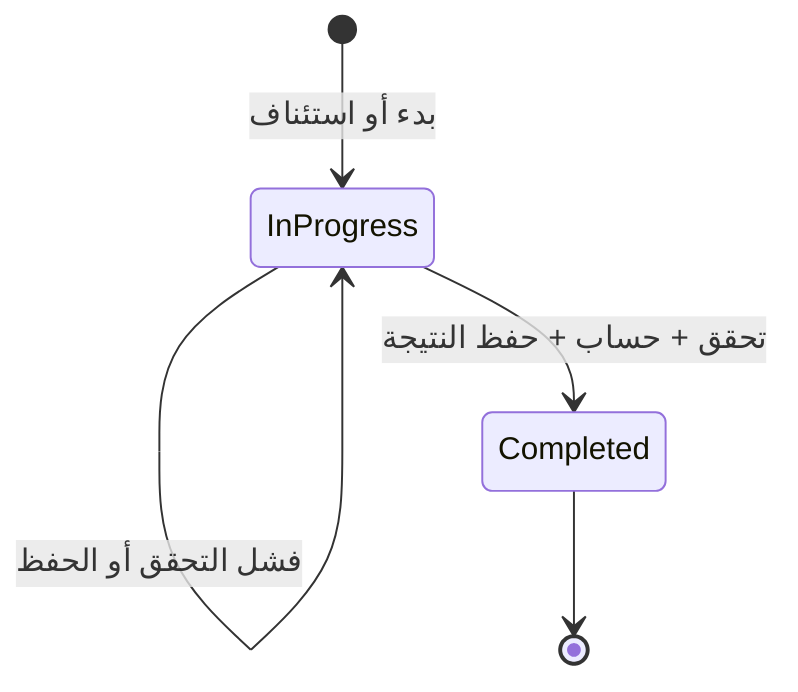
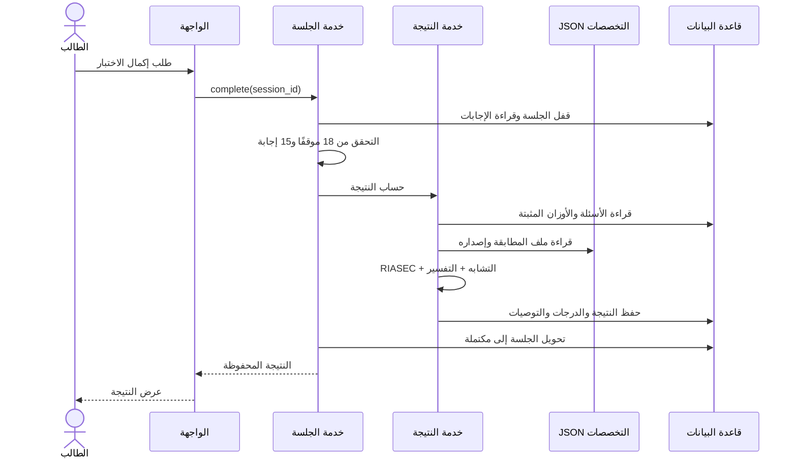

<div dir="rtl" lang="ar">

# المرحلة السادسة — نموذج البيانات ومخططات النظام

**الملف:** `08-data-model-and-diagrams.md`  
**الحالة:** معتمدة للتنفيذ  
**آخر تحديث:** 2026-09-11  
**المرجع:** المعمارية ومسارات العمل وحالات الاستخدام المعتمدة.  
**النطاق:** البيانات، العلاقات، القيود، ودورات الحالة.  
**خارج النطاق:** كتابة Migrations، تصميم API، وتصميم الشاشات.

---

## 1. قرار تخزين البيانات

| البيانات | مكانها | السبب |
|---|---|---|
| الحسابات والصلاحيات | MySQL | حساسة ومتغيرة |
| إصدارات التقييم والأسئلة | MySQL | تحتاج إدارة وتاريخًا ثابتًا |
| الجلسات والإجابات | MySQL | تحتاج حفظًا واستئنافًا |
| النتائج والدرجات والتوصيات | MySQL | يجب الرجوع إليها دون إعادة حساب |
| دليل التخصصات وملفات RIASEC | JSON داخل الخادم | محتوى ثابت ومراجع |
| الإحصائيات | استعلامات من البيانات الحالية | لا حاجة إلى تكرار التخزين |
| بيانات SCCT وSEVT | مؤجلة | لم تعتمد أسئلتها التشغيلية بعد |

---

## 2. الكيانات الأساسية

لدينا **9 جداول مجال** فقط:

| الجدول | وظيفته |
|---|---|
| `users` | حساب الطالب أو المدير |
| `assessment_versions` | نسخة ثابتة من نموذج التقييم |
| `questions` | مواقف النسخة |
| `question_options` | الخيارات ومجالاتها وأوزانها |
| `assessment_sessions` | محاولة الطالب وحالتها |
| `answers` | إجابة الطالب لكل موقف |
| `results` | رأس النتيجة وإصداراتها |
| `result_scores` | درجات RIASEC الست |
| `result_recommendations` | التخصصات المقترحة المحفوظة |

جداول Laravel التشغيلية، مثل إعادة كلمة المرور وSession، لا تعد كيانات مجال ولا تظهر في ERD الأساسي.

---

## 3. مخطط الكيانات والعلاقات



---

## 4. قاموس البيانات المختصر

### 4.1 `users`

| الحقل | القاعدة |
|---|---|
| `email` | فريد ومطبع قبل الحفظ |
| `password` | Hash فقط |
| `role` | `student` أو `admin` |

لا ننشئ جدول أدوار وصلاحيات؛ لأن النظام يملك دورين فقط.

### 4.2 `assessment_versions`

| الحقل | القاعدة |
|---|---|
| `version_number` | رقم متزايد وفريد |
| `status` | `draft` أو `active` أو `retired` |
| `published_at` | يملأ عند التفعيل |

- يوجد إصدار نشط واحد فقط.
- الإصدار النشط أو المتقاعد غير قابل للتعديل.
- تفعيل إصدار جديد يحيل السابق إلى `retired`.

### 4.3 `questions`

| الحقل | القاعدة |
|---|---|
| `assessment_version_id` | النسخة المالكة |
| `position` | من 1 إلى 18 وفريد داخل النسخة |
| `scenario` | نص الموقف الذي يراه الطالب |

### 4.4 `question_options`

| الحقل | القاعدة |
|---|---|
| `question_id` | السؤال المالك |
| `position` | ترتيب داخلي من 1 إلى 4 |
| `riasec_code` | أحد R, I, A, S, E, C |
| `closest_weight` | القيمة المعتمدة: +2 |
| `least_weight` | القيمة المعتمدة: -1 |

موضع العرض يُخلط في الواجهة، ولا يغير `position` المخزن أو ارتباط المجال.

### 4.5 `assessment_sessions`

| الحقل | القاعدة |
|---|---|
| `user_id` | مالك الجلسة |
| `assessment_version_id` | الإصدار المثبت منذ البدء |
| `status` | `in_progress` أو `completed` |
| `started_at` | وقت البدء |
| `completed_at` | فارغ حتى الإكمال |

لا نخزن نسبة التقدم؛ تُحسب من الإجابات حتى لا تتعارض البيانات.

### 4.6 `answers`

| الحقل | القاعدة |
|---|---|
| `assessment_session_id` + `question_id` | إجابة واحدة فقط لكل موقف |
| `closest_option_id` | خيار الأقرب، أو فارغ عند التجاوز |
| `least_option_id` | خيار الأقل، أو فارغ عند التجاوز |
| `is_skipped` | يوضح تعذر الحكم |

الحالتان الصحيحتان فقط:

- `is_skipped = false`: الخياران موجودان ومختلفان.
- `is_skipped = true`: الخياران فارغان.

يجب أن ينتمي السؤال إلى إصدار الجلسة، وأن ينتمي الخياران إلى السؤال نفسه.

### 4.7 `results`

| الحقل | القاعدة |
|---|---|
| `assessment_session_id` | فريد؛ نتيجة واحدة للجلسة |
| `catalog_version` | إصدار ملفات التخصصات المستخدمة |
| `created_at` | وقت إنتاج النتيجة |

إصدار التقييم معروف من الجلسة، لذلك لا نكرره في النتيجة.

### 4.8 `result_scores`

| الحقل | القاعدة |
|---|---|
| `result_id` + `riasec_code` | صف واحد لكل مجال |
| `raw_score` | الدرجة الخام |
| `normalized_score` | الدرجة الموحدة 0–100 للاستخدام الداخلي |

كل نتيجة مكتملة يجب أن تحتوي ستة صفوف بالضبط. لا نخزن الترتيب؛ يُشتق من الدرجة حتى يبقى التعادل صحيحًا.

### 4.9 `result_recommendations`

| الحقل | القاعدة |
|---|---|
| `specialization_key` | معرف ثابت يقابل التخصص في JSON |
| `name_snapshot` | اسم التخصص وقت إنتاج النتيجة |
| `display_order` | ترتيب العرض من 1 إلى 5 |
| `similarity_score` | قيمة داخلية لا تعرض كنسبة يقين |
| `rationale_snapshot` | سبب التقارب وقت إنتاج النتيجة |

حفظ الاسم والسبب يمنع تغير النتيجة التاريخية عند تحديث محتوى الدليل.

---

## 5. علاقات وقواعد الحذف

| العلاقة | القاعدة |
|---|---|
| مستخدم ← جلسات | واحد إلى متعدد |
| إصدار ← أسئلة | واحد إلى 18 عند النشر |
| سؤال ← خيارات | واحد إلى 4 |
| إصدار ← جلسات | واحد إلى متعدد |
| جلسة ← إجابات | واحد إلى 18 |
| جلسة ← نتيجة | صفر أو واحدة |
| نتيجة ← درجات | واحدة إلى 6 |
| نتيجة ← توصيات | واحدة إلى 3–5 |

قواعد الحذف:

- لا توجد وظيفة حذف حساب أو جلسة أو نتيجة في النسخة الأولى.
- لا يحذف إصدار استُخدم في جلسة.
- يجوز حذف مسودة فقط قبل استخدامها.
- حذف نتيجة يدويًا محظور.
- لا نضيف Soft Deletes دون وظيفة فعلية تحتاجها.

---

## 6. القيود والفهارس

| الجدول | القيد أو الفهرس |
|---|---|
| `users` | Unique: `email` |
| `assessment_versions` | Unique: `version_number`، Index: `status` |
| `questions` | Unique: `assessment_version_id, position` |
| `question_options` | Unique: `question_id, position` |
| `assessment_sessions` | Index: `user_id, status` و`assessment_version_id, status` |
| `answers` | Unique: `assessment_session_id, question_id` |
| `results` | Unique: `assessment_session_id` |
| `result_scores` | Unique: `result_id, riasec_code` |
| `result_recommendations` | Unique: `result_id, specialization_key` و`result_id, display_order` |

وجود جلسة غير مكتملة واحدة للطالب في الإصدار نفسه يضمنه Service داخل Transaction مع قفل الصفوف؛ لأن MySQL لا يوفر Partial Unique Index مباشرًا لهذه الحالة.

---

## 7. مخطط حالة جلسة التقييم



قواعد الحالة:

- لا تعود الجلسة المكتملة إلى غير مكتملة.
- لا تعدل إجابات الجلسة المكتملة.
- فشل الإكمال لا ينشئ نتيجة جزئية.
- بدء اختبار جديد يحدث بعد إكمال السابق، في جلسة جديدة.

---

## 8. مخطط تسلسل إكمال التقييم



تتم خطوات القفل والحساب والحفظ وتغيير الحالة داخل **Database Transaction واحدة**.

---

## 9. ملف التخصصات الثابت

البنية المنطقية المطلوبة:

| الحقل | الغرض |
|---|---|
| `catalog_version` | رقم إصدار الملف |
| `updated_at` | تاريخ المراجعة |
| `specializations[]` | التخصصات العشرة |
| `key` | معرف ثابت لا يتغير بتغير الاسم |
| `name` | الاسم العربي |
| `content` | أقسام الدليل المعتمدة |
| `sources` | المصادر وتاريخ التحقق |
| `riasec_profile` | القيم الست المستخدمة في المطابقة |

مثال ملف المجال:

```json
{
  "R": 0,
  "I": 0,
  "A": 0,
  "S": 0,
  "E": 0,
  "C": 0
}
```

القيم الفعلية لا تعتمد في هذه المرحلة؛ يراجعها المختصون قبل استخدامها.

---

## 10. العمليات الذرية

### نشر إصدار تقييم

داخل Transaction:

1. قفل الإصدار النشط.
2. التحقق من 18 سؤالًا و4 خيارات والتوازن والأوزان.
3. تحويل النشط السابق إلى `retired`.
4. تحويل المسودة إلى `active`.
5. تسجيل وقت النشر.

### حفظ إجابة

- استخدام Upsert على مفتاح الجلسة والسؤال.
- إعادة الطلب نفسه لا تنشئ صفًا مكررًا.
- يمنع الحفظ بعد إكمال الجلسة.

### إكمال جلسة

داخل Transaction:

1. قفل الجلسة.
2. إذا كانت مكتملة، تعاد النتيجة الموجودة.
3. التحقق من الإجابات.
4. الحساب والمطابقة.
5. حفظ النتيجة والدرجات والتوصيات.
6. تحويل الجلسة إلى مكتملة.
7. Commit.

هذا يجعل طلب الإكمال **Idempotent** وآمنًا عند تكراره بسبب ضعف الاتصال.

---

## 11. الخصوصية والاتساق

- كل وصول إلى جلسة أو نتيجة يتحقق من `user_id`.
- المدير يرى الإحصائيات المجمعة، لا إجابات الطلاب الفردية.
- لا تسجل كلمات المرور أو روابط الاستعادة في سجلات التطبيق.
- لا تخزن معلومات شخصية لا تحتاجها المنصة.
- لا تعتمد الواجهة لإثبات ملكية البيانات أو صحة الخيارات.
- القيم الرقمية الداخلية لا تعرض كنسب نجاح أو يقين.

---

## 12. ترتيب إنشاء الجداول لاحقًا

1. `users`
2. `assessment_versions`
3. `questions`
4. `question_options`
5. `assessment_sessions`
6. `answers`
7. `results`
8. `result_scores`
9. `result_recommendations`

هذا الترتيب يحترم المفاتيح الخارجية ويقلل مشاكل Migrations.

---

## 13. مخططات لم ننشئها

| المخطط | القرار |
|---|---|
| Use Case Diagram | غير لازم؛ حالات الاستخدام النصية أوضح |
| Class Diagram | غير لازم الآن؛ حُددت مسؤوليات Services وModels نصيًا في التصميم البرمجي الداخلي |
| Deployment Diagram | مؤجل حتى اختيار بيئة النشر |
| Activity Diagram لكل وظيفة | تكرار لمسارات العمل |
| DFD متعدد المستويات | لا يضيف قيمة بعد تحديد الوحدات والتدفقات |

---

## 14. أساس اعتماد المرحلة

اعتمدت المرحلة بناءً على:

- الجداول التسعة فقط.
- عدم إنشاء جدول للتخصصات أو الإحصائيات.
- العلاقات والقيود والفهارس.
- تثبيت إصدار التقييم والكتالوج داخل النتيجة.
- تنفيذ الإكمال والنشر داخل Transactions.
- المخططات الثلاثة المعتمدة.
- تأجيل أسئلة SCCT وSEVT حتى اعتمادها تشغيليًا.

أُنجزت بعد هذه المرحلة عقود النظام والتصميم البرمجي الداخلي. تتحول الجداول والقيود المعتمدة إلى Migrations وModels ضمن Issue التنفيذ المخصصة لذلك، ولا يعاد تصميمها أثناء البرمجة دون قرار موثق.

</div>
