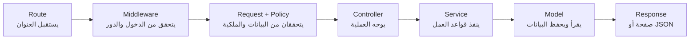

<div dir="rtl" lang="ar">

# المرحلة الثامنة — التصميم البرمجي الداخلي

**الملف:** `10-detailed-design.md`  
**الحالة:** معتمدة للتنفيذ  
**آخر تحديث:** 2026-09-11  
**الهدف:** توضيح الأجزاء البرمجية المطلوبة ومسؤولية كل جزء قبل إنشاء الكود.  
**لا تشمل:** هيكل Laravel الكامل، Migrations، الواجهات، أو توزيع العمل على الفريق.

---

## 1. كيف ينفذ النظام الطلب؟



لا يلزم أن يمر كل طلب بكل الأجزاء. صفحة عامة مثل دليل التخصصات لا تحتاج Policy.

---

## 2. معنى الأجزاء

| الجزء | وظيفته ببساطة |
|---|---|
| Route | يربط عنوان الطلب بالـController المناسب |
| Middleware | يتحقق من تسجيل الدخول ودور المستخدم |
| Form Request | يتحقق من صحة البيانات المرسلة |
| Policy | يتحقق من ملكية المورد أو صلاحية التعامل معه |
| Controller | يستقبل الطلب ويستدعي الخدمة ثم يعيد الاستجابة |
| Service | ينفذ قواعد المشروع والعملية الفعلية |
| Model | يمثل جدولًا وعلاقاته |
| Enum | يمنع استخدام قيم غير معتمدة |
| View | صفحة Blade التي تظهر للمستخدم |

---

## 3. أماكن الأجزاء

| النوع | المكان المتوقع |
|---|---|
| Enums | `app/Enums` |
| Controllers | `app/Http/Controllers` |
| Form Requests | `app/Http/Requests` |
| Middleware | `app/Http/Middleware` |
| Policies | `app/Policies` |
| Models | `app/Models` |
| Services | `app/Services` |
| ملف التخصصات | `resources/data/specializations.json` |
| Views | `resources/views` |
| JavaScript | `resources/js` |
| اختبارات الوحدات | `tests/Unit` |
| اختبارات المسارات | `tests/Feature` |

هذه أماكن متوقعة وليست هيكل المشروع النهائي. لا ننشئ مجلدًا أو ملفًا قبل وجود وظيفة فعلية له.

---

## 4. Services المطلوبة

### 4.1 `AssessmentSessionService`

**وظيفته:**

- بدء جلسة أو استئناف الموجودة.
- تثبيت إصدار التقييم في الجلسة.
- حفظ الإجابة أو استبدالها.
- حساب تقدم الطالب.

**لا يفعل:**

- حساب درجات RIASEC.
- مطابقة التخصصات.
- عرض الصفحات.

**يتعامل مع:** جلسة التقييم، الأسئلة، الإجابات، والمستخدم.

### 4.2 `AssessmentCompletionService`

**وظيفته:**

- قفل الجلسة أثناء الإكمال.
- التحقق من 18 موقفًا و15 إجابة محتسبة.
- استدعاء الحساب والمطابقة.
- حفظ النتيجة والدرجات والتوصيات.
- تحويل الجلسة إلى مكتملة داخل Transaction واحدة.
- إعادة النتيجة الموجودة عند تكرار الطلب.

**لا يفعل:** تنفيذ معادلة الحساب بنفسه.

### 4.3 `ScoringService`

**وظيفته:**

- استقبال الإجابات والأوزان.
- حساب الدرجات الخام والموحدة للمجالات الستة.
- ترتيب المجالات مع الحفاظ على التعادل.

**خصائصه:**

- لا يقرأ HTTP.
- لا يحفظ في قاعدة البيانات.
- يعيد نتيجة حساب يمكن اختبارها منفصلة.

### 4.4 `RecommendationService`

**وظيفته:**

- مقارنة درجات الطالب بملفات التخصصات.
- حساب تشابه جيب التمام.
- اختيار 3–5 تخصصات.
- إنتاج سبب تقارب مختصر.

**لا يعرض:** قيمة التشابه للطالب كنسبة يقين.

### 4.5 `SpecializationCatalogService`

**وظيفته:**

- قراءة ملف التخصصات.
- التحقق من إصدار الملف وبنيته.
- جلب تخصص أو قائمة التخصصات.
- تجهيز بيانات المقارنة.
- توفير ملفات RIASEC لخدمة المطابقة.

**لا يفعل:** تعديل ملف التخصصات من لوحة المدير.

### 4.6 `AssessmentVersionService`

**وظيفته:**

- إنشاء مسودة أو نسخ إصدار سابق.
- إضافة سؤال كامل أو استبداله مع خياراته.
- حذف سؤال من المسودة.
- التحقق من شروط النشر.
- نشر إصدار جديد وإحالة السابق إلى متقاعد.

**القاعدة:** لا يعدل إصدار نشط أو متقاعد.

### 4.7 `StatisticsService`

**وظيفته:**

- حساب الجلسات التي بدأت والمكتملة.
- حساب نسبة الإكمال.
- استخراج أكثر التخصصات ظهورًا.
- تطبيق الفترة الزمنية المطلوبة.

**لا يفعل:** عرض إجابات طالب أو تعديل البيانات.

---

## 5. Controllers المطلوبة

| Controller | مسؤوليته | الخدمة التي يستدعيها |
|---|---|---|
| `SpecializationController` | عرض القائمة والتفاصيل والمقارنة | `SpecializationCatalogService` |
| `AssessmentSessionController` | المقدمة، البدء، العرض، والإكمال | خدمتا الجلسة والإكمال |
| `AssessmentAnswerController` | استقبال حفظ الإجابة | `AssessmentSessionService` |
| `ResultController` | عرض سجل النتائج ونتيجة واحدة | Models مع Policy |
| `Admin/AssessmentVersionController` | المسودات والنشر | `AssessmentVersionService` |
| `Admin/QuestionController` | إضافة السؤال واستبداله وحذفه | `AssessmentVersionService` |
| `Admin/StatisticsController` | عرض الإحصائيات | `StatisticsService` |

قواعد Controller:

- لا يحتوي معادلة حساب.
- لا ينفذ Transaction.
- لا يكتب استعلامات طويلة.
- يعيد View أو JSON حسب عقد المسار.

---

## 6. Form Requests المطلوبة

| Form Request | يتحقق من |
|---|---|
| `CompareSpecializationsRequest` | وجود تخصصين مختلفين |
| `SaveAnswerRequest` | حالة التجاوز والخيارين |
| `CreateAssessmentDraftRequest` | صحة الإصدار المصدر إن وجد |
| `UpsertQuestionRequest` | السؤال وخياراته الأربعة والرموز والأوزان |
| `StatisticsFilterRequest` | صحة تاريخ البداية والنهاية |

لا نحتاج Form Request لطلب إكمال الاختبار؛ لأنه لا يرسل Body. شروط الإكمال قاعدة عمل داخل Service.

---

## 7. Middleware وPolicies

### Middleware

| Middleware | الوظيفة |
|---|---|
| `auth` | التحقق من تسجيل الدخول |
| `EnsureUserHasRole` | التحقق من دور الطالب أو المدير |

### Policies

| Policy | الوظيفة |
|---|---|
| `AssessmentSessionPolicy` | الطالب يصل إلى جلسته فقط |
| `ResultPolicy` | الطالب يصل إلى نتيجته فقط |
| `AssessmentVersionPolicy` | المدير يدير المسودة فقط |

الفرق:

- Middleware يتحقق من المستخدم والدور.
- Policy تتحقق من المورد المحدد وملكيته.
- Service تتحقق من حالة المورد وقواعد العمل.

---

## 8. Models المطلوبة

| Model | مسؤوليته الأساسية |
|---|---|
| `User` | الحساب والدور وعلاقة الجلسات |
| `AssessmentVersion` | إصدار التقييم وحالته |
| `Question` | موقف داخل إصدار |
| `QuestionOption` | خيار ورمز RIASEC وأوزانه |
| `AssessmentSession` | محاولة الطالب وحالتها |
| `Answer` | إجابة موقف داخل جلسة |
| `Result` | رأس النتيجة وإصداراتها |
| `ResultScore` | درجة مجال واحد |
| `ResultRecommendation` | تخصص مقترح محفوظ |

قواعد Models:

- تحدد العلاقات وعمليات التحويل البسيطة.
- لا تستقبل Request.
- لا تعرض View.
- لا تحتوي عملية الإكمال أو النشر كاملة.
- الحقول الحساسة لا تسمح بالتعبئة العشوائية.

---

## 9. Enums المطلوبة

| Enum | القيم |
|---|---|
| `UserRole` | `student`، `admin` |
| `AssessmentVersionStatus` | `draft`، `active`، `retired` |
| `AssessmentSessionStatus` | `in_progress`، `completed` |
| `RiasecCode` | `R`، `I`، `A`، `S`، `E`، `C` |

الغرض من Enum هو منع الأخطاء الإملائية والقيم غير المعتمدة.

---

## 10. تنفيذ العمليات الأساسية

### بدء الاختبار أو استئنافه

```text
Route
→ AssessmentSessionController
→ AssessmentSessionService
→ البحث عن جلسة غير مكتملة
→ إعادة الموجودة أو إنشاء جديدة
→ JSON يحتوي رابط الجلسة
```

### حفظ الإجابة

```text
Route
→ SaveAnswerRequest
→ AssessmentSessionPolicy
→ AssessmentAnswerController
→ AssessmentSessionService
→ Upsert للإجابة
→ JSON يؤكد الحفظ والتقدم
```

### إكمال الاختبار

```text
Route
→ AssessmentSessionPolicy
→ AssessmentSessionController
→ AssessmentCompletionService
→ ScoringService
→ RecommendationService
→ حفظ النتيجة داخل Transaction
→ JSON يحتوي رابط النتيجة
```

### نشر إصدار التقييم

```text
Route
→ دور المدير
→ AssessmentVersionPolicy
→ AssessmentVersionController
→ AssessmentVersionService
→ تحقق كامل
→ نشر داخل Transaction
```

---

## 11. الأخطاء التي يجب منعها

| الحالة | التصرف |
|---|---|
| حفظ الطلب مرتين | تحديث الإجابة نفسها |
| إكمال الاختبار مرتين | إعادة النتيجة الموجودة |
| تعديل جلسة مكتملة | رفض 409 |
| الوصول إلى جلسة طالب آخر | إرجاع 404 |
| سؤال أو خيار من إصدار مختلف | رفض الإجابة |
| نشر مسودة ناقصة أو غير متوازنة | رفض 422 |
| فشل الإكمال أثناء الحفظ | إلغاء العملية كاملة |
| ملف تخصصات غير صالح | منع المطابقة وتسجيل خطأ داخلي آمن |

---

## 12. الاختبارات المطلوبة

### Unit Tests

| الخدمة | أهم ما يختبر |
|---|---|
| `ScoringService` | المعادلة، التجاوز، الحدود، والتعادل |
| `RecommendationService` | التشابه، الترتيب، والتقارب |
| `AssessmentVersionService` | شروط النشر والتوازن |
| `SpecializationCatalogService` | صحة JSON والمفاتيح الستة |

### Feature Tests

- التسجيل والدخول والصلاحيات.
- بدء جلسة أو استئنافها.
- حفظ الإجابة وتعديلها.
- رفض الخيارات غير التابعة للسؤال.
- إكمال صالح ورفض الإكمال الناقص.
- تكرار طلب الإكمال دون نتيجة مكررة.
- منع الوصول إلى جلسة أو نتيجة مستخدم آخر.
- منع تعديل إصدار منشور.
- نشر مسودة صحيحة.
- عرض الإحصائيات للمدير فقط.

---

## 13. قواعد الفريق

- كل قاعدة عمل لها مكان واحد.
- Controller ينسق ولا ينفذ المنطق.
- Form Request يتحقق من شكل المدخلات.
- Policy تتحقق من الملكية.
- Service تنفذ قواعد المشروع.
- Model يمثل البيانات والعلاقات.
- JavaScript لا يحسب النتيجة ولا يقرر الصلاحية.
- لا نستخدم Repository أو Interface أو Event دون حاجة مثبتة.
- لا ننشئ Service لمجرد إعادة استدعاء Model.
- أي تغيير على هذا التقسيم يوثق قبل التنفيذ.

---

## 14. ما نفذ بعد اعتماد التصميم وما بقي للتنفيذ

| العنصر | الحالة الحالية |
|---|---|
| إنشاء مشروع Laravel واختبار البيئة | تم |
| اعتماد القرارات التقنية | تم |
| تقسيم الأدوار وخطة المهام | تم |
| دليل GitHub ومراجعة الكود | تم |
| بناء الهيكل البرمجي الفعلي | ينفذ عبر Issues المعتمدة |
| كتابة Migrations وModels والكود | تنفذ عبر Issues المعتمدة |
| تنفيذ الواجهات | ينفذ عبر Issues المعتمدة |
| الاختبارات والتكامل والإصدار | تنفذ حسب دفعات خطة العمل |

---

## 15. أساس اعتماد المرحلة

اعتمدت المرحلة بناءً على:

- الأجزاء البرمجية المطلوبة.
- مسؤولية كل Service وController.
- أماكن التحقق والصلاحيات.
- مسار العمليات الأربع الأساسية.
- قائمة الاختبارات.
- عدم وجود طبقات أو ملفات بلا وظيفة.

المرحلة الحالية هي تجهيز GitHub ثم تحويل خطة العمل إلى Issues والبدء بالدفعة الأولى. يبقى هذا التصميم المرجع الذي تُشتق منه الملفات البرمجية، ولا تضاف طبقة أو خدمة بلا مسؤولية موثقة.

</div>
